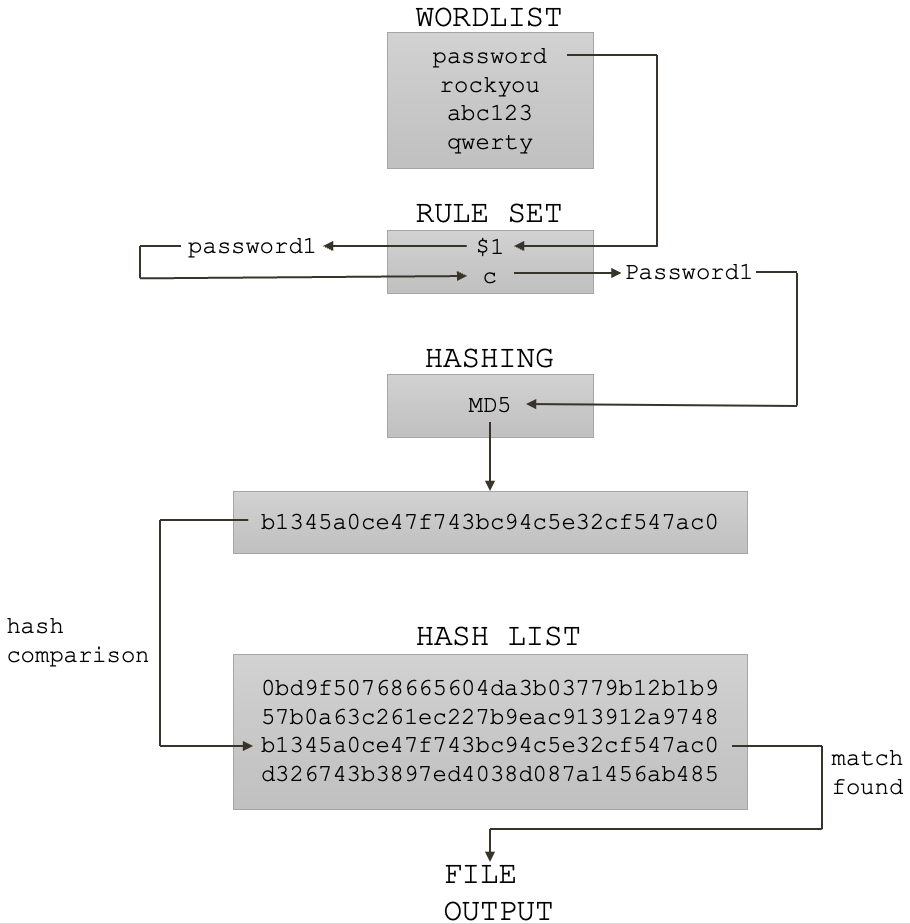

# Lab 2: Password Cracking

* First read this page then start working through the lab with the GitHub classroom link below.
* Github Classroom Link: []()

### Objective

Learn about how passwords are cracked with the latest tools. 

### The password cracking process

1. Create or use an existing list of potential passwords.
2. Apply the same hashing algorithm that the system used to create the hash value.
3. Compare that hash value to the one recovered from the system.
4. If they match, you have cracked the password! 
5. If they do not match, try the next password.




## Cracking Tool: `hashcat`


### Mask attack (Brute-force)

[Mask attack](https://hashcat.net/wiki/doku.php?id=mask_attack): Try all combinations from a given keyspace just like in Brute-Force attack, but more specific. 

A __mask__ is a simple string that configures the keyspace of the password candidate engine using placeholders.

#### Built-in charsets

* __?l__ = abcdefghijklmnopqrstuvwxyz
* __?u__ = ABCDEFGHIJKLMNOPQRSTUVWXYZ
* __?d__ = 0123456789
* __?h__ = 0123456789abcdef
* __?H__ = 0123456789ABCDEF
* __?s__ = «space»!"#$%&'()*+,-./:;\<=\>?@[\]^_`{|}~
* __?a__ = ?l?u?d?s
* __?b__ = 0x00 - 0xff

#### Example masks

* 7 lower case letters ?l?l?l?l?l?l?l
* 6 lower case followed by two digits ?l?l?l?l?l?l?d?d
* 6 lower case followed by special characters ?l?l?l?l?l?l?s?s

### Try this

1. Copy the example0.hash file to your home directory.
    ```
    $ cp /usr/share/doc/hashcat-data/examples/example0.hash ~
    ```
2. View the hashes listed in the `example0.hash` file. And count the number of hashes in the file.
    ```
    $ cat example0.hash
    $ wc -l example0.hash
    ```
3. Run the `hashcat` program to attempt to crack some of the passwords in the `example0.hash` file. We will use the `-m 0` to specify the `MD5` hash algorithm. We will use the `-a 3` flag for attack mode 3, which is the "Mask Attack". We will provide the hash file to crack, and the mask which instructs `hashcat` which character sets to use in which position in the passwords that it guesses. We will start with trying a seven lower case letter password. Hashcat will print out cracked passwords like this: `e691253bdabbf723a9644e0ed1a6d31b:shuzman`, the hash value followed by a semicolon and then the password.
    ```
    $ hashcat -m 0 -a 3 example0.hash ?l?l?l?l?l?l?l
    ```
4. If it pauses you can select `s` to print the status and then `f` to finish.
5. When it is complete you can view the passwords that you cracked by looking at your hashcat potfile.
    ```
    $ cat ~/.local/share/hashcat/hashcat.potfile
    ```
6. How many passwords did you crack? Hint `wc -l ~/.local/share/hashcat/hashcat.potfile`
7. Next lets try to add another lower case letter to our mask so it now generates passwords with 8 lower case letters: `?l?l?l?l?l?l?l?l`.  Re-run step 3 with this new mask. 
8. You can stop this run after a few minutes by typing `q` to quit.
9. How many did you crack this time? Hint: re-run the word count command in step 6, but subtract the results from the first run.
10. Now change your mask to generate passwords with 6 lower case letters followed by 2 digits at the end. How many did you crack?
11. How many brute-force passwords are attempted with the ?l?l?l?l?l?l?l mask?
12. How about the ?l?l?l?l?l?l?d?d mask?


### Dictionary attack (aka. Wordlist attack)

[Dictionary Attack](https://hashcat.net/wiki/doku.php?id=dictionary_attack):  All that is needed is to read line by line from a textfile (aka “dictionary” or “wordlist”) and try each line as a password candidate. 

1. Copy the example.dict file to your home directory.
    ```
    $ cp /usr/share/doc/hashcat-data/examples/example.dict ~
    ```
2. View the some of the words in the `example.dict` file. And count the number of words in the file.
    ```
    $ tail -1000 example.dict
    $ wc -l example.dict
    ```
3. Run the `hashcat` program to attempt to crack some of the passwords in the `example0.hash` file. We will use the `-m 0` to specify the `MD5` hash algorithm. We will use the `-a 0` flag for attack mode 0, which is the "Dictionary Attack". We will provide the hash file to crack, and the dictionary from which to gather attempted password guesses.
    ```
    $ hashcat -m 0 -a 0 example0.hash example.dict
    ```
4. If it pauses you can select `s` to print the status and then `f` to finish.
5. When it is complete you can view the passwords that you cracked by looking at your hashcat potfile.
    ```
    $ cat ~/.local/share/hashcat/hashcat.potfile
    ```
6. How many passwords did you crack? Hint `wc -l ~/.local/share/hashcat/hashcat.potfile` and compare with previous count.


### Rule based attack

[Rule Based Attack](https://hashcat.net/wiki/doku.php?id=rule_based_attack): The rule-based attack (-a 0 with one or more -r rules files) is one of the most complicated of all the attack modes. The reason for this is very simple. The rule-based attack is like a programming language designed for password candidate generation. It has functions to modify, cut or extend words and has conditional operators to skip some, etc. That makes it the most flexible, accurate and efficient attack. 

1. Copy the dive.rule file to your home directory.
    ```
    $ cp /usr/share/hashcat/rules/dive.rule ~
    ```
2. View the some of the rules in the `dive.rule` file. And count the number of rules in the file.
    ```
    $ head -100 dive.rule
    $ wc -l dive.rule
    ```
3. Run the `hashcat` program to attempt to crack some of the passwords in the `example0.hash` file. We will use the `-m 0` to specify the `MD5` hash algorithm. We will use the `-a 0` flag for attack mode 0, which is the "Dictionary Attack" but we also specify a `-r dive.rule` which turns on rules. We will provide the hash file to crack, and the dictionary from which to gather attempted password guesses.
    ```
    $ hashcat -m 0 -a 0 -r dive.rule example0.hash example.dict
    ```
4. You can type q to quit after it runs for a few minutes.
5. When it is complete you can view the passwords that you cracked by looking at your hashcat potfile.
    ```
    $ cat ~/.local/share/hashcat/hashcat.potfile
    ```
6. How many passwords did you crack? Hint `wc -l ~/.local/share/hashcat/hashcat.potfile` and compare with previous count.
7. Why did the rules based attack crack more passwords than the dictionary attack, even though it uses the same dictionary? 
8. Now lets try this with a different word list. The infamous `rockyou.txt`. 
    ```
    $ cp /usr/share/wordlists/rockyou.txt.gz ~
    $ gzip -d rockyou.txt.gz
    ```
9. Take a look at the rockyou word list.
    ```
    $ head -100 rockyou.txt
    ```
10. Notice that the list is not in alphabetical order like the example.dict.  It is in order by most common passwords. Do you think this will improve the performance of you password cracking attempts?
11. Give it a try:
    ```
    $ hashcat -m 0 -a 0 -r dive.rule example0.hash rockyou.txt
    ```
12. You can type q to quit after it runs for a few minutes.
13. When it is complete you can view the passwords that you cracked by looking at your hashcat potfile.
    ```
    $ cat ~/.local/share/hashcat/hashcat.potfile
    ```
14. How many passwords did you crack? Hint `wc -l ~/.local/share/hashcat/hashcat.potfile` and compare with previous count.


