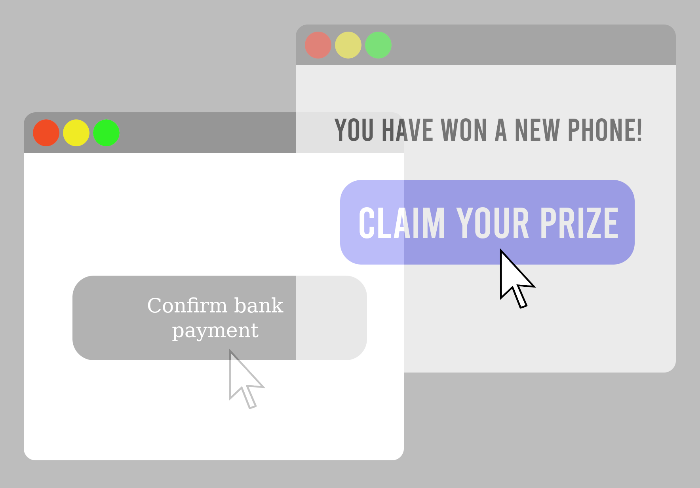

# Lab 7: Clickjacking

* First read this page then start working through the lab with the GitHub classroom link below. 
* The files that you need to complete this lab are also found in the GitHub repository.
* Put your answers in the `README.md` file in the GitHub repository.
* Github Classroom Link: []()


## Overview of Clickjacking




[__Clickjacking__](https://en.wikipedia.org/wiki/Clickjacking) is an attack that tricks a user into clicking on something they do not intend to when visiting a webpage, thus "hijacking" the click. It exploits the ability to load a transparent layer over a web page and have the user's input affect the transparent layer without the user noticing.

In this lab, we will explore a common attack vector for __clickjacking__: the attacker creates a webpage that loads the content of a legitimate page but overlays one or more of its buttons with invisible button(s) that trigger malicious actions. When a user attempts to click on the legitimate page's buttons, the browser registers a click on the invisible button instead, triggering the malicious action.

Example scenario. Suppose an attacker acquires the domain `starbux.com` and creates a website with that URL. The site first loads the legitimate target website `starbucks.com` in an `iframe` element spanning the entire webpage, so that the malicious `starbux.com` website looks identical to the legitimate `starbucks.com` website. The attacker's site then places an invisible button on top of the _Menu_ button on the displayed starbucks page; the button triggers a _1-click_ purchase of the attacker's product on Amazon. If the user is logged on to Amazon when they try to click the legitimate button, the inadvertent click on the invisible button will make the unintended purchase without the user's knowledge or consent.

This lab covers the following topics:

- Clickjacking attack
- Countermeasures: frame busting and HTTP headers
- Iframes and sandboxes
- JavaScript

## Important Note:

In the following instructions, you must replace the __# sign__ with the server number assigned to you for this module. For example, if your number is 4 then `spiderwebdev#.xyz` should be replaced with `spiderwebdev4.xyz`

## Lab Setup

In this lab, we will use two websites. The first is the vulnerable homepage of the fictional business "Alice's Cupcakes", accessible at `https://spiderwebdev#.xyz/cupcakes/`. The second is the attacker's malicious web site that is used for hijacking clicks intended for the Alice's Cupcakes page, accessible at `https://attackwebdev#.xyz/attack/attacker.html`. 

__Important note__. Any time you make updates to the websites, you may need to clear the browser's cache and refresh the page.

##### Setup and Test: Alice's cupcakes

Alice's cupcakes will be hosted on your `spiderwebdev#` web server. Copy the files into place in the `/var/www/html` directory. You may need to make the `/var/www/html` directory writable. You can do that by setting the permissions with `sudo chmod a+rwx /var/www/html`. 

1. In the `/var/www/html` directory on `spiderwebdev#` create a new directory called `cupcakes`.
    ```SHELL
    $ mkdir /var/www/html/cupcakes
    ```
2. From your GitHub repository folder `cupcakes` copy the files `index.html` and `defender.css` into the `/var/www/html/cupcakes` folder.
3. Next, navigate to the page `https://spiderwebdev#.xyz/cupcakes/`. You should see a page for Alice's Cupcakes, a fictional local bakery. Note that the header and footer buttons on the site are just placeholders and do not contain live links.

##### Setup and Test: Attacker

The attacker website will be hosted on your `attackwebdev#` web server. Copy the files into place in the `/var/www/html` directory. You may need to make the `/var/www/html` directory writable. You can do that by setting the permissions with `sudo chmod a+rwx /var/www/html`. 

1. In the `/var/www/html` directory on `attackwebdev#` create a new directory called `attack`.
    ```SHELL
    $ mkdir /var/www/html/attack
    ```
2. From your GitHub repository folder `attack` copy the files `attacker.html`, `hacked.html` and `attacker.css` into the `/var/www/html/attack` folder.
3. Next, navigate to the page `https://attackwebdev#.xyz/attack/attacker.html`. You should see a single button which, when clicked, takes you to a page that tells you you've been hacked. In a real attack, this button could perform a variety of malicious actions. The goal of the attacker is to overlay this button onto a view of the defender's (Alice's cupcakes) webpage displayed on the attacker's site, so that a victim user will inadvertently click the malicious button when they think they are clicking a button on the defender's (Alice's cupcakes) webpage.

## Lab Tasks

### Task 1: Copy that site!

In the `cupcakes` folder, you will find the files comprising the website for Alice's Cupcakes: `index.html` and `defender.css`. In the `attack` folder, you will find the files comprising the attacker's web-site: `attacker.html` and `attacker.css`. You will be making changes to all of these files except `defender.css` throughout the lab. Our first step as the attacker is to add code to `attacker.html` so that it mimics the Alice's Cupcakes website as closely as possible. A common way to do this is with an HTML Inline Frame element ("__iframe__"). An `iframe` enables embedding one HTML page within another. The `src` attribute of the `iframe` specifies the site to be embedded, and when the `iframe` code is executed on a page, the embedded site is loaded into the `iframe`.

Embed the defender's site (Alice's cupcakes) into the attacker's site.

- Add an `iframe` HTML element in `attacker.html` that pulls from `https://spiderwebdev#.xyz/cupcakes/`.
- Modify the CSS in `attacker.css` using the height, width, and position attributes to make the iframe cover the whole page and the button overlay the `iframe`.
- Hints:
    - View the html files in the `examples` folders and load them in the browser to see the results. 
    - Explicitly set the `iframe` to have no border.
    - Investigate the 'absolute' and 'relative' settings of the position attribute to determine which should be used.
    - Test your changes by navigating to the attacker's website. (Remember that you may need to clear the browser's cache and reload the page to see changes made after the initial load.)
    - __Note:__ you should also modify the version number of the css in the `attacker.html` file each time you modify the `attacker.css` file, this will instruct the browser to load your new version of the css file. For example, change `version=1` to `version=2` the first time you modify `attacker.css`. You still need to clear the cache in the browser.  On `Firefox` this is done by going to `History->Clear Recent History...`, then clicking the `Clear Now` button.

```HTML
<link href="attacker.css?version=1" type="text/css" rel="stylesheet"/>
```

__Question:__

1. With the `iframe` inserted, what does the attacker's website look like?


### Let's Get Clickjacking!

Basic __clickjacking__ attack. Add code to the CSS specification of a "button" object given in `attacker.css` to make the malicious button in `attacker.html` invisible. Position the button so that it covers the "Explore Menu" button within the `iframe` added in the previous Task. There are a variety of ways to accomplish this Task; we recommend using the CSS attributes margin-left,margin-top, color, and background-color. When this Task is complete, you will have a functioning __clickjacking__ attack.

__Questions:__

2. How does the appearance of the attacker's site compare to that of the defender's site?
3. What happens when you click on the "Explore Menu" button on the attacker's site?
4. Describe an attack scenario in which the style of __clickjacking__ implemented for this Task leads to undesirable consequences for a victim user.

### Task 2: Bust That Frame!

"Frame busting" is the practice of preventing a web page from being displayed within a frame, thus defending against the type of attack implemented in the previous Task. One way to bust frames is to include script code in the webpage source that prevents the site from being framed – that is, it prevents other sites from opening the webpage in an `iframe`. In this Task we will add script code to the defender's webpage that ensures it is the topmost window on any page where it is being displayed, thus preventing buttons on an attacker's page from being overlaid on top of it.

Write the frame-busting script. Open the file `cupcakes/index.html`, which contains code for the Alice's Cupcakes homepage. We would like to protect the homepage from __clickjacking__. Your task is to fill in the Javascript method called `makeThisFrameOnTop()`. Your code should compare `window.top` and `window.self` to find out if the top window and the current site's window are the same object (as they should be). If not, use the Location Object to set the location of the top window to be the same as the location of the current site's window. This should be a simple method and take no more than a few lines of code. Test it out and confirm that your script successfully stops the __clickjacker__.

__Example:__
```JavaScript
if (window.top !== window.self) {
    window.top.location = window.self.location;
}
```

__Reminder.__ Remember that any time you make changes to one of the websites, you may need to clear the browser's cache and reload the page for the changes to take effect.

__Questions:__

5. What happens when you navigate to the attacker's site now?
6. What happens when you click the button?

### Task 3: Attacker Countermeasure (Bust the Buster)

Disable the frame-busting script. Now let's explore how an attacker can create a workaround for front-end clickjacking defenses like frame busting. There are multiple workarounds, but one of the simplest in the current scenario is to add the sandbox attribute to the malicious `iframe`. Read more about the sandbox attribute on this page about iframes: [https://developer.mozilla.org/en-US/docs/Web/HTML/Element/iframe](https://developer.mozilla.org/en-US/docs/Web/HTML/Element/iframe) Then add the sandbox attribute to the `iframe` in `attacker.html` and answer the following questions.

__Questions:__

7. What does the sandbox attribute do? Why does this prevent the frame buster from working?
8. What happens when you navigate to the attacker's site after updating the `iframe` to use the sandbox attribute?
9. What happens when you click the button on the attacker's site?


### Learn more

There are other ways to perform clickjacking besides the one explored in this lab, and many
possible malicious consequences beyond the ones suggested here. To learn more about clickjacking, visit
the Open Web Application Security Project (OWASP) page on Clickjacking here. [https://owasp.org/www-community/attacks/Clickjacking](https://owasp.org/www-community/attacks/Clickjacking)


