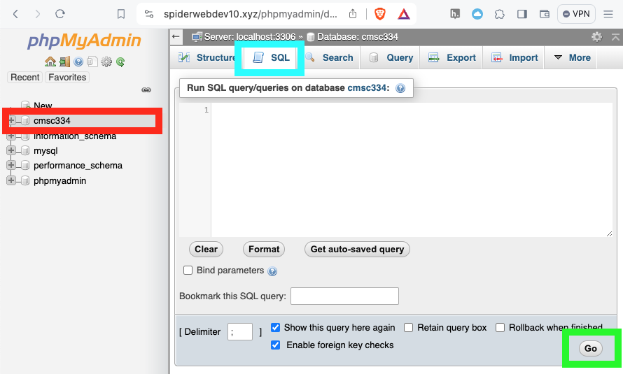
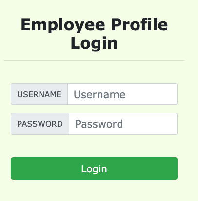
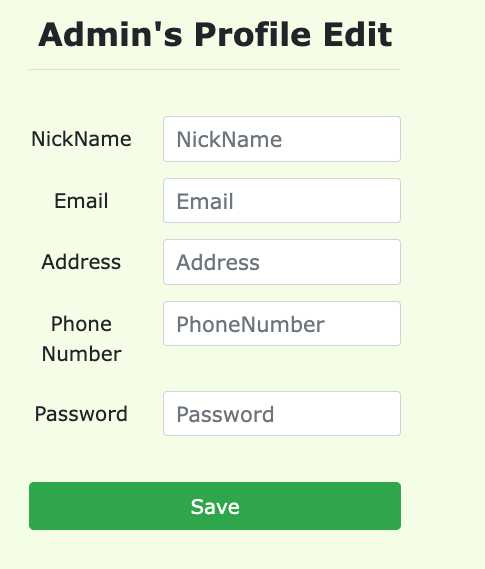

# Lab 8: SQL Injection

* First read this page then start working through the lab with the GitHub classroom link below. 
* The files that you need to complete this lab are also found in the GitHub repository.
* Put your answers in the `README.md` file in the GitHub repository.
* Github Classroom Link: [https://classroom.github.com/a/WL_l-t2N](https://classroom.github.com/a/WL_l-t2N)

## Overview of SQL Injection


SQL injection is a code injection technique that exploits the vulnerabilities in the interface between web applications and database servers. The vulnerability is present when user's inputs are not correctly checked within the web applications before being sent to the back-end database servers.

Many web applications take inputs from users, and then use these inputs to construct SQL queries, so they can get information from the database. Web applications also use SQL queries to store information in the database. These are common practices in the development of web applications. When SQL queries are not carefully constructed,  SQL injection vulnerabilities can occur. __SQL injection is one of the most common attacks on web applications.__

In this lab, we have created a web application that is vulnerable to the SQL injection attack. Our web application includes the common mistakes made by many web developers. Your goal is to find ways to exploit the SQL injection vulnerabilities, demonstrate the damage that can be achieved by the attack, and master the techniques that can help defend against such type of attacks.

This lab covers the following topics:
- SQL statements: `SELECT` and `UPDATE` statements
- SQL injection
- Prepared statements


## Lab Setup

The URL for the web application is: [https://spiderwebdev10.xyz/sql/](https://spiderwebdev10.xyz/sql)

The URL for the database is: [https://spiderwebdev10.xyz/phpmyadmin/](https://spiderwebdev10.xyz/phpmyadmin/)


### About the Web Application

The web application is a simple employee management application. Employees can view and update their personal information in the database through this web application. There are two roles in this web application: 
- `Administrator` is a privilege role and can manage each individual
employees' profile information
- `Employee` is a normal role and can view or update his/her own profile 
information. All employee information is described in table below.

| Name  | EID        | Password   | Salary  | birth | SSN | NickName | Email | Address | PhoneNumber |
| :---  | :---       | :---       | :---    | :---  | :---      | :--- | :--- | :--- | :--- |
| Admin | 99999      | a5bdf35... | 400000  | 3/5   | 43254314	| | | | |
| Alice | 10000      | fdbe918... | 20000   | 9/20  | 10211002	| | | | |
| Bob 	| 20000      | b78ed97... | 50000   | 4/20  | 10213352	| | | | |
| Ryan  | 30000      | a3c5027... | 90000   | 4/10  | 32193525	| | | | |
| Samy 	| 40000	     | 995b8b8... | 40000   | 1/11  | 32111111  | | | | |
| Ted   | 50000	     | 99343bf... | 110000  | 11/3  | 24343244	| | | | |

 
## Lab Tasks

### Task 1: Get Familiar with SQL Statements

##### phpMyAdmin

The objective of this task is to get familiar with SQL commands by playing with the provided database. The data used by our web application is stored in a MySQL database. I have created a database called `cmsc334`, which contains a table called `credential`. The table stores the personal information (e.g. eid, password, salary, ssn, etc.) of every employee. In this task, you need to play with the database to get familiar with SQL queries.

In a web browser go to the database GUI front end called `phpMyAdmin`: [https://spiderwebdev10.xyz/phpmyadmin/](https://spiderwebdev10.xyz/phpmyadmin/)

The credentials to login with the username `cmsc334` are provided on our Slack workspace `#general` channel.



After login, you can run sql queries on the `cmsc334` database by selecting the `cmsc334` database on the left hand side of the `phpMyAdmin` page. Shown highlighted in red in the image above. Then select the `SQL` tab to enter an SQL query. Shown highlighted in blue above.  After entering an SQL query you can click the `Go` button, shown highlighted in green above. 

To show what tables are there in the `cmsc334` database, 
you can use the `show tables` command to print out all the tables of the
selected database.


__Question:__

* Write an SQL `SELECT` command to print all the information of the employee Alice in the `credential` table. 


##### Test SQL Injection String

To practice SQL injection in phpMyAdmin. Assume you have the following SQL statement, and the injection string is `' or 1=1;-- -`.  The extra dash is there because the SQL comment `--` will only begin if there is a space after the `--`. 

```sql
SELECT * from credential 
WHERE name='$name' and password='$pwd';
```

You can replace the value of `$name` with the injection string and test it using the MySQL console. This approach can help you construct a syntax-error  free injection string before launching the real attack.

### Task 2: SQL Injection Attack on `SELECT` Statement

SQL injection is technique through which attackers can execute their own malicious SQL statements generally referred as malicious payload. Through the malicious SQL statements, attackers can steal information from the victim database; even worse, they may be able to make changes to the database. Our employee management web application has SQL injection vulnerabilities, which mimic 
the mistakes frequently made by developers. 

We will use the login page from [https://spiderwebdev10.xyz/sql/](https://spiderwebdev10.xyz/sql)for this task. The login page is shown in below.



It asks users to provide a username and a password. The web application authenticate users based on these two pieces of data, so only employees who know their passwords are allowed to log in. Your job, as an attacker, is to log into the web application without knowing any employee's credential. 

To help you started with this task, we explain how authentication is implemented in the web application. The PHP code `unsafe_home.php`, located in the `/var/www/html/sql/` directory, is used to conduct user authentication. The following code snippet show how users are authenticated. 

```php
$input_uname = $_GET['username'];
$input_pwd = $_GET['Password'];
$hashed_pwd = sha1($input_pwd);
...
$sql = "SELECT id, name, eid, salary, birth, ssn, address, email, 
               nickname, Password
        FROM credential
        WHERE name= '$input_uname' and Password='$hashed_pwd'";
$result = $conn -> query($sql);

// The following is Pseudo Code 
if(id != NULL) {
  if(name=='admin') {
     return All employees information;
  } else if (name != NULL) {
    return employee information;
  }
} else {
  Authentication Fails;
}
```

The above SQL statement selects personal employee information such as id, name, salary, ssn, etc. from the `credential` table. The SQL statement uses two variables `input_uname` and `hashed_pwd`, where `input_uname` holds the string typed by users in the username field of the login page, while `hashed_pwd` holds the `sha1` hash of the password typed by the user. The program checks whether any record matches with the provided username and password; if there is a match, the user is successfully authenticated, and is given the corresponding employee information. If there is no match, the authentication fails. 


#### Task 2.1: SQL Injection Attack From Webpage

Your task is to log into the web application as the administrator from the login page, so you can see the information of all the employees. We assume that you do know the administrator's account name which is `admin`, but you do not the password. You need to decide what to type in the `Username` and `Password` fields to succeed in the attack.


__Question:__
* Explain how you used SQL injection to log into the web application as administrator.


#### Task 2.2: SQL Injection Attack From Command Line 

Your task is to repeat Task 2.1, but you need to do it without using the webpage. You can use command line tools, such as `curl`, which can send HTTP requests. One thing that is worth mentioning is that if you want to include multiple parameters in HTTP requests, you need to put the URL and the parameters between a pair of single quotes; otherwise, the special characters used to separate parameters (such as `&`) will be interpreted by the shell program, changing the meaning of the command. The following example shows how to send an HTTP GET request to our 
web application, with two parameters (`username` and `Password`) attached:

```bash
$ curl 'spiderwebdev10.xyz/unsafe_home.php?username=alice&Password=abc>'
```

If you need to include special characters in the username or Password fields, you need to encode them properly, or they can change the meaning of your requests. If you want to include single quote in those fields, you should use `%27` instead; if you want to include white space, you should use `%20`. In this task, you do need to handle HTTP encoding while sending requests using curl.

__Question:__
* What `curl` command did you use to attack the admin account via the command line? 

#### Task 2.3: Append a New SQL Statement

In the above two attacks, we can only steal information from the database; it will be better if we can modify the database using the same vulnerability in the login page.  An idea is to use the SQL injection attack to turn one SQL statement into two, with the second one being the `update` or `insert` statement. In SQL, semicolon (`;`) is used to separate two SQL statements. Please try to run two SQL statements via the login page. 

__Important note:__ Please don't run `delete` any columns or tables.


__Question:__
* What two SQL commands did you run as an SQL injection attack? 


### Task 3: SQL Injection Attack on `UPDATE` Statement

If a SQL injection vulnerability happens to an `UPDATE` statement, the damage will be more severe, because attackers can use the vulnerability to modify databases. In our Employee Management application, there is an Edit Profile page that allows employees to update their profile information, including nickname, email, address, phone number, and password. To go to this page, employees need to log in first. 



When employees update their information through the Edit Profile page, the following SQL `UPDATE` query will be executed. The PHP code implemented in `unsafe_edit_backend.php` file is used to update employee's profile information. The PHP file is located in the `/var/www/html/sql/` directory.

```php
$hashed_pwd = sha1($input_pwd);
$sql = "UPDATE credential 
    SET nickname='$input_nickname', email='$input_email',
	    address='$input_address', Password='$hashed_pwd',
	    PhoneNumber='$input_phonenumber'
	WHERE ID=$id;";
$conn->query($sql);
```
 
#### Task 3.1: Modify Your Own Salary 
As shown in the Edit Profile page, employees can only update their nicknames, emails, addresses, phone numbers, and passwords; they are not authorized to change their salaries.  Assume that you (Alice) are a disgruntled employee, and your boss Bob did not increase your salary this year. You want to increase your own salary by exploiting the SQL injection vulnerability in the Edit-Profile page. Please demonstrate how you can achieve that. We assume that you do know that salaries are stored in a column called `salary`.

__Question:__
* Explain how you used SQL injection to modify Alice's salary.


#### Task 3.2: Modify Other Salaries
After increasing your own salary, you decide to punish your boss Bob. You want to reduce his
salary to 1 dollar. Please demonstrate how you can achieve that. 

__Question:__
* Explain how you used SQL injection to modify Bob's salary.

#### Task 3.3: Modify Passwords

After changing Bob's salary, you are still disgruntled, so you want to change Bob's password to something that you know, and then you can log into his account and do further damage. Please demonstrate how you can achieve that. You need to demonstrate that you can 
successfully log into Bob's account using the new password.  One thing worth mentioning here is that the database stores the hash value of passwords instead of the plaintext password string. You can again look at the `unsafe_edit_backend.php` code to see how password is being stored. It
uses `SHA1` hash function to generate the hash value of password. 

__Hint:__ You can generate a `SHA1` hash has on the command line with the following command:

```bash
$ echo -n YOUR_TEXT_HERE | sha1sum | awk '{print $1}'
```

__Question:__
* Explain how you used SQL injection to modify Bob's password.
