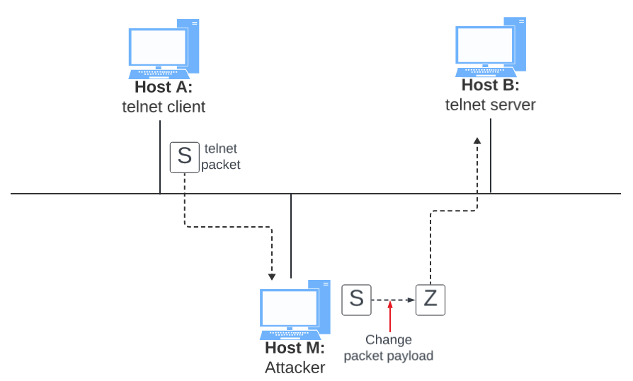

# Module 13: ARP Cache Poisoning Attack

* Put your answers in the `README.md` file in the GitHub repository.
* Github Classroom Link: []()

## Overview

The Address Resolution Protocol (ARP) is a communication protocol used for discovering the link layer address, such as the MAC address, given an IP address. The ARP protocol is a very simple protocol, and it does not implement any security measure. The ARP cache poisoning attack is a common attack against the ARP protocol. Using such an attack, attackers can fool the victim into accepting forged IP-to-MAC mappings. This can cause the victim’s packets to be redirected to the computer with the forged MAC address, leading to potential man-in-the-middle attacks.

The objective of this lab is for students to gain the first-hand experience on the ARP cache poisoning attack, and learn what damages can be caused by such an attack. In particular, students will use the ARP attack to launch a man-in-the-middle attack, where the attacker can intercept and modify the packets between the two victims A and B. Another objective of this lab is for students to practice packet sniffing and spoofing skills, as these are essential skills in network security, and they are the building blocks for many network attack and defense tools. Students will use the `Scapy` Python library to conduct lab tasks. 

This lab covers the following topics:

- The ARP protocol
- The ARP cache poisoning attack
- Man-in-the-middle attack
- `Scapy` programming

## Setup

In this module, we will use three machines that are connected to the same LAN. Figure 1 depicts the module environment setup. 


__Figure 1.__ Local Area Network


Add the following to your .ssh/config file on your local machine, and __replace `yournetid` with your UR netid__.  

__Note:__ you may have already added these to your config file for Module 12.

```
Host cmsc334-1
HostName x-mcs-cmsc334-1.richmond.edu
User yournetid
IdentityFile ~/.ssh/id_rsa_cmsc334

Host cmsc334-2
HostName x-mcs-cmsc334-2.richmond.edu
User yournetid
IdentityFile ~/.ssh/id_rsa_cmsc334

Host cmsc334-3
HostName x-mcs-cmsc334-3.richmond.edu
User yournetid
IdentityFile ~/.ssh/id_rsa_cmsc334

Host cmsc334-4
HostName x-mcs-cmsc334-4.richmond.edu
User yournetid
IdentityFile ~/.ssh/id_rsa_cmsc334

Host cmsc334-5
HostName x-mcs-cmsc334-5.richmond.edu
User yournetid
IdentityFile ~/.ssh/id_rsa_cmsc334
```

You should now be able to ssh directly to the Kali linux machines that we will use for this module. 

```shell
$ ssh cmsc334-1
```

After you login to `cmsc334-1` run interface configure command `ifconfig` to list the active network interfaces and take note of the ethernet network interface and IPv4 address.

For example, when running the `ifconfig` command below, the network interface is `eth0`, and the IPv4 address is `172.18.123.6`. The interface `lo` is the loopback interface which is always `127.0.0.1` and is used for testing purposes.
```shell
$ ifconfig
eth0: flags=4163<UP,BROADCAST,RUNNING,MULTICAST>  mtu 1500
        inet 172.18.123.6  netmask 255.255.254.0  broadcast 172.18.123.255
        inet6 fe80::ea6a:64ff:fece:4bdf  prefixlen 64  scopeid 0x20<link>
        ether e8:6a:64:ce:4b:df  txqueuelen 1000  (Ethernet)
        RX packets 174589  bytes 49208123 (46.9 MiB)
        RX errors 0  dropped 1  overruns 0  frame 0
        TX packets 96386  bytes 21776671 (20.7 MiB)
        TX errors 0  dropped 0 overruns 0  carrier 0  collisions 0
        device interrupt 17  memory 0xb1100000-b1120000

lo: flags=73<UP,LOOPBACK,RUNNING>  mtu 65536
        inet 127.0.0.1  netmask 255.0.0.0
        inet6 ::1  prefixlen 128  scopeid 0x10<host>
        loop  txqueuelen 1000  (Local Loopback)
        RX packets 4  bytes 200 (200.0 B)
        RX errors 0  dropped 0  overruns 0  frame 0
        TX packets 4  bytes 200 (200.0 B)
        TX errors 0  dropped 0 overruns 0  carrier 0  collisions 0
```

### Packet sniffing

Being able to sniff packets is very important in this lab, because if things do not go as expected, being able to look at where packets go can help us identify the problems. There are several different ways to do packet sniffing:

- Running `tcpdump`. To sniff the packets going through a particular interface, we just need to find out the interface name, and then do the following (assume that the interface name is `eth0`):
    ```shell
    # sudo su
    # tcpdump -i eth0 -n
    ```
- Using `Scapy` to sniff packets. (See module 12.)

## Task 1: ARP cache poisoning

The objective of this task is to use packet spoofing to launch an ARP cache poisoning attack on a target, such that when two victim machines __A__ and __B__ try to communicate with each other, their packets will be intercepted by the attacker, who can make changes to the packets, and can thus become the man in the middle between __A__ and __B__. This is called Man-In-The-Middle (MITM) attack. In this task, we focus on the ARP cache poisoning part. The following code skeleton shows how to construct an ARP packet using `Scapy`.

```python
#!/usr/bin/env python
from scapy.all import *

E = Ether()
A = ARP()
# 1 for ARP request; 2 for ARP reply
A.op = 1 

pkt = E/A
sendp(pkt)
```


The above program constructs and sends an ARP packet. Please set necessary attribute names/values to define your own ARP packet. We can use `ls(ARP)` and `ls(Ether)` to see the attribute names of the `ARP` and `Ether` classes. If a field is not set, a default value will be used (see the third column of the output):

```python
$ python
>>> from scapy.all import *

>>> ls(Ether)
dst : DestMACField = (None)
src : SourceMACField = (None)
type : XShortEnumField = (36864)

>>> ls(ARP)
hwtype : XShortField = (1)
ptype : XShortEnumField = (2048)
hwlen : ByteField = (6)
plen : ByteField = (4)
op : ShortEnumField = (1)
hwsrc : ARPSourceMACField = (None)
psrc : SourceIPField = (None)
hwdst : MACField = (’00:00:00:00:00:00’)
pdst : IPField = (’0.0.0.0’)
```

In this task, we have three machines (containers), __A__, __B__, and __M__. We use __M__ as the attacker machine. We would like to cause __A__ to add a fake entry to its ARP cache, such that __B__’s IP address is mapped to __M__’s MAC address. We can check a computer’s ARP cache using the following command. If you want to look at the ARP cache associated with a specific interface, you can use the `-i` option.

```shell
$ arp -n
Address HWtype HWaddress Flags Mask Iface
10.0.2.1 ether 52:54:00:12:35:00 C enp0s
10.0.2.3 ether 08:00:27:48:f4:0b C enp0s
```

There are many ways to conduct ARP cache poisoning attack. Try the following three methods, and report whether each method works or not.

- __SubTask 1 (using ARP request):__ On host __M__, construct an ARP request packet to map __B__’s IP address to __M__’s MAC address. Send the packet to __A__ and check whether the attack is successful or not. Report the results of your attack in your `README.md` file.
- __SubTask 2 (using ARP reply):__ On host __M__, construct an ARP reply packet to map __B__’s IP address to __M__’s MAC address. Send the packet to __A__ and check whether the attack is successful or not. Try the attack under the following two scenarios, and report the results of your attack in your `README.md` file:
       - Scenario 1: __B__’s IP is already in __A__’s cache.
       - Scenario 2: __B__’s IP is not in __A__’s cache. To test this scenario you can use the command `arp -d a.b.c.d` to remove the ARP cache entry for __B__'s IP address a.b.c.d.
- __SubTask 3 (using ARP gratuitous message):__ On host __M__, construct an ARP gratuitous packet, and use it to map __B__’s IP address to __M__’s MAC address. Please launch the attack under the same two scenarios as those described in SubTask 2. ARP gratuitous packet is a special ARP request packet. It is used when a host machine needs to update outdated information on all the other machine’s ARP cache. The gratuitous ARP packet has the following characteristics:
       - The _source_ and _destination_ IP addresses are the same, and they are the IP address of the host issuing the gratuitous ARP.
       - The _destination_ MAC addresses in both ARP header and Ethernet header are the broadcast MAC address `ff:ff:ff:ff:ff:ff`.
       - No reply is expected.
Report the results of your attack in your `README.md` file.


## 4 Task 2: MITM attack on `telnet` using ARP cache poisoning

Hosts __A__ and __B__ are communicating using `telnet`, and Host __M__ wants to intercept their communication, so it can make changes to the data sent between __A__ and __B__. The setup is depicted in Figure 2. 



__Figure 2.__ Machine in the middle attack against `telnet`.

__Step 1 (Launch the ARP cache poisoning attack):__ First, Host __M__ conducts an ARP cache poisoning attack on both __A__ and __B__, such that in __A__’s ARP cache, __B__’s IP address maps to __M__’s MAC address, and in __B__’s ARP cache, __A__’s IP address also maps to __M__’s MAC address. After this step, packets sent between __A__ and __B__ will all be sent to __M__. We will use the ARP cache poisoning attack from Task 1 to achieve this goal. It is better that you send out the spoofed packets constantly (e.g. every 5 seconds); otherwise, the fake entries may be replaced by the real ones.

__Step 2 (Testing):__ After the attack is successful, please try to ping each other between Hosts __A__ and __B__, and report your observation. Please show `tcpdump` results in your README.md file. Before doing this step, please make sure that the IP forwarding on Host __M__ is turned off. You can do that with the following command (as root):

```shell
$ sudo sysctl net.ipv4.ip_forward=0
```

__Step 3 (Turn on IP forwarding):__ Now we turn on the IP forwarding on Host __M__, so it will forward the packets between __A__ and __B__. Please run the following command (as root) and repeat Step 2. Please describe your observation in your README.md file.

```shell
$ sudo sysctl net.ipv4.ip_forward=1
```

__Step 4 (Launch the MITM attack):__ We are ready to make changes to the `telnet` data between __A__ and __B__. Assume that __A__ is the `telnet` client and __B__ is the `telnet` server. After __A__ has connected to the telnet server on __B__, for every key stroke typed in A’s `telnet` window, a TCP packet is generated and sent to __B__. We would like to intercept the TCP packet, and replace each typed character with a fixed character (say Z). This way, it does not matter what the user types on A, `telnet` will always display Z. From the previous steps, we are able to redirect the TCP packets to Host M, but instead of forwarding them, we would like to replace them with a spoofed packet. We will write a sniff-and-spoof program to accomplish this goal. In particular, we would like to do the following:

- We first keep the IP forwarding on, so we can successfully create a `telnet` connection between __A__ to __B__. Once the connection is established, we turn off the IP forwarding using the following command (run as root). Please type something on __A__’s `telnet` window, and report your observation:

```shell 
$ sudo sysctl net.ipv4.ip_forward=0
```

- We run our sniff-and-spoof program on Host __M__, such that for the captured packets sent from __A__ to __B__, we spoof a packet but with TCP different data. For packets from __B__ to __A__ (telnet response), we do not make any change, so the spoofed packet is exactly the same as the original one.

To help you get started, we provide a skeleton sniff-and-spoof program below. The program captures all the TCP packets, and then for packets from __A__ to __B__, it makes some changes (the modification part is not included, because that is part of the task). For packets from __B__ to __A__, the program does not make any change.

```python
#!/usr/bin/env python
from scapy.all import *

IP_A = "10.9.0.5"
MAC_A = "02:42:0a:09:00:05"
IP_B = "10.9.0.6"
MAC_B = "02:42:0a:09:00:06"

def spoof_pkt(pkt):
    if pkt[IP].src == IP_A and pkt[IP].dst == IP_B:
        # Create a new packet based on the captured one.
        # 1) We need to delete the checksum in the IP & TCP headers,
        # because our modification will make them invalid.
        # Scapy will recalculate them if these fields are missing.
        # 2) We also delete the original TCP payload.
        newpkt = IP(bytes(pkt[IP]))
        del(newpkt.chksum)
        del(newpkt[TCP].payload)
        del(newpkt[TCP].chksum)

        #################################################################
        # Construct the new payload based on the old payload.
        # Students need to implement this part.
        if pkt[TCP].payload:
        data = pkt[TCP].payload.load # The original payload data
        newdata = data # No change is made in this sample code
        send(newpkt/newdata)
        else:
        send(newpkt)
        ################################################################

    elif pkt[IP].src == IP_B and pkt[IP].dst == IP_A:
        # Create new packet based on the captured one
        # Do not make any change
        newpkt = IP(bytes(pkt[IP]))
        del(newpkt.chksum)
        del(newpkt[TCP].chksum)
        send(newpkt)

f = ’tcp’
pkt = sniff(iface=’eth0’, filter=f, prn=spoof_pkt)
```

It should be noted that the code above captures all the TCP packets, including the one generated by the program itself. That is undesirable, as it will affect the performance. You need to change the filter, so it does not capture its own packets.

Behavior of `telnet`. In `telnet`, typically, every character we type in the `telnet` window triggers an individual TCP packet, but if you type very fast, some characters may be sent together in the same packet. That is why in a typical `telnet` packet from client to server, the payload only contains one character. The character sent to the server will be echoed back by the server, and the client will then display the character in its window. Therefore, what we see in the client window is not the direct result of the typing; whatever we type in the client window takes a round trip before it is displayed. If the network is disconnected, whatever we typed on the client window will not displayed, until the network is recovered. Similarly, if attackers change the character to Z during the round trip, Z will be displayed at the `telnet` client window, even though that is not what you have typed.


## Task 3: MITM Attack on Netcat using ARP Cache Poisoning

This task is similar to Task 2, except that Hosts A and B are communicating using `netcat`, instead of `telnet`. Host __M__ wants to intercept their communication, so it can make changes to the data sent between __A__ and __B__. You can use the following commands to establish a `netcat` TCP connection between __A__ and __B__:

On Host __B__ (server, IP address is 10.9.0.6), run the following:

```shell
$ nc -lp 9090
```

On Host __A__ (client), run the following:

```shell
$ nc 10.9.0.6 9090
```

Once the connection is made, you can type messages on __A__. Each line of messages will be put into a TCP packet sent to __B__, which simply displays the message. Your task is to replace every occurrence of your first name in the message with a sequence of __A__’s. The length of the sequence should be the same as that of your first name, or you will mess up the TCP sequence number, and hence the entire TCP connection. You need to use your real first name, so we know the work is done by you.


