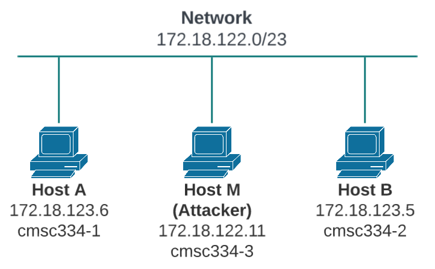

# Module 13: ARP Cache Poisoning Attack

* Put your answers in the `README.md` file in the GitHub repository.
* Github Classroom Link: [https://classroom.github.com/a/JyHHg_4W](https://classroom.github.com/a/JyHHg_4W)

## Overview

The Address Resolution Protocol (ARP) is a communication protocol used for discovering the link layer address, such as the MAC address, given an IP address. The ARP protocol is a very simple protocol, and it does not implement any security measure. The ARP cache poisoning attack is a common attack against the ARP protocol. Using such an attack, attackers can fool the victim into accepting forged IP-to-MAC mappings. This can cause the victim’s packets to be redirected to the computer with the forged MAC address, leading to potential machine-in-the-middle attacks.

The objective of this module is for you to gain the first-hand experience on the ARP cache poisoning attack, and learn what damages can be caused by such an attack. Another objective of this module is for you to practice packet sniffing and spoofing skills, as these are essential skills in network security, and they are the building blocks for many network attack and defense tools. You will use the `Scapy` Python library to conduct module tasks. 

This module covers the following topics:

- The ARP protocol
- The ARP cache poisoning attack
- `Scapy` programming

## Setup

In this module, we will use three machines that are connected to the same LAN. Figure 1 depicts the module environment setup. 



__Figure 1.__ Local Area Network


Add the following to your .ssh/config file on your local machine, and __replace `yournetid` with your UR netid__.  

__Note:__ you may have already added these to your config file for Module 12.

```
Host cmsc334-1
HostName x-mcs-cmsc334-1.richmond.edu
User yournetid
IdentityFile ~/.ssh/id_rsa_cmsc334

Host cmsc334-2
HostName x-mcs-cmsc334-2.richmond.edu
User yournetid
IdentityFile ~/.ssh/id_rsa_cmsc334

Host cmsc334-3
HostName x-mcs-cmsc334-3.richmond.edu
User yournetid
IdentityFile ~/.ssh/id_rsa_cmsc334

Host cmsc334-4
HostName x-mcs-cmsc334-4.richmond.edu
User yournetid
IdentityFile ~/.ssh/id_rsa_cmsc334

Host cmsc334-5
HostName x-mcs-cmsc334-5.richmond.edu
User yournetid
IdentityFile ~/.ssh/id_rsa_cmsc334
```

You should now be able to ssh directly to the Kali linux machines that we will use for this module. 

```shell
$ ssh cmsc334-1
```

After you login to `cmsc334-1` run interface configure command `ifconfig` to list the active network interfaces and take note of the ethernet network interface and IPv4 address.

For example, when running the `ifconfig` command below, the network interface is `eth0`, and the IPv4 address is `172.18.123.6`. The interface `lo` is the loopback interface which is always `127.0.0.1` and is used for testing purposes.
```shell
$ ifconfig
eth0: flags=4163<UP,BROADCAST,RUNNING,MULTICAST>  mtu 1500
        inet 172.18.123.6  netmask 255.255.254.0  broadcast 172.18.123.255
        inet6 fe80::ea6a:64ff:fece:4bdf  prefixlen 64  scopeid 0x20<link>
        ether e8:6a:64:ce:4b:df  txqueuelen 1000  (Ethernet)
        RX packets 174589  bytes 49208123 (46.9 MiB)
        RX errors 0  dropped 1  overruns 0  frame 0
        TX packets 96386  bytes 21776671 (20.7 MiB)
        TX errors 0  dropped 0 overruns 0  carrier 0  collisions 0
        device interrupt 17  memory 0xb1100000-b1120000

lo: flags=73<UP,LOOPBACK,RUNNING>  mtu 65536
        inet 127.0.0.1  netmask 255.0.0.0
        inet6 ::1  prefixlen 128  scopeid 0x10<host>
        loop  txqueuelen 1000  (Local Loopback)
        RX packets 4  bytes 200 (200.0 B)
        RX errors 0  dropped 0  overruns 0  frame 0
        TX packets 4  bytes 200 (200.0 B)
        TX errors 0  dropped 0 overruns 0  carrier 0  collisions 0
```

### Packet sniffing

Being able to sniff packets is very important in this module, because if things do not go as expected, being able to look at where packets go can help us identify the problems. There are several different ways to do packet sniffing:

- Running `tcpdump`. To sniff the packets going through a particular interface, we just need to find out the interface name, and then do the following (assume that the interface name is `eth0`):
    ```shell
    # sudo su
    # tcpdump -i eth0 -n
    ```
- Using `Scapy` to sniff packets. (See module 12.)


## Task: ARP cache poisoning

The objective of this task is to use packet spoofing to launch an ARP cache poisoning attack on a target, such that when two victim machines __A__ and __B__ try to communicate with each other, their packets will be intercepted by the attacker, who can make changes to the packets, and can thus become the machine in the middle between __A__ and __B__. This is called Machine-In-The-Middle (MITM) attack. In this task, we focus on the ARP cache poisoning part. The following code skeleton shows how to construct an ARP packet using `Scapy`.

```python
#!/usr/bin/env python
from scapy.all import *


target_IP = "172.18.123.6"
target_MAC = "e8:6a:64:ce:4b:df"

fake_IP = "172.18.123.99"
fake_MAC = "aa:bb:cc:dd:ee:ff"


# Construct ethernet header
ethernet = Ether()
ethernet.dst = target_MAC 
ethernet.src = fake_MAC

# Construct ARP packet
arp = ARP()
arp.op = 1                         # 1 for ARP request; 2 for ARP reply
arp.psrc = target_IP               # IP source
arp.hwsrc = target_MAC             # MAC source
arp.pdst = fake_IP                 # IP destination
arp.hwdst = fake_MAC               # MAC destination

 
# Encapsulate the ARP packet in the ethernet frame
frame = ethernet/arp

# Send the frame
sendp(frame)
```


The above program constructs and sends an ARP packet. Please set necessary attribute names/values to define your own ARP packet. We can use `ls(ARP)` and `ls(Ether)` to see the attribute names of the `ARP` and `Ether` classes. If a field is not set, a default value will be used (see the third column of the output):

```python
$ python
>>> from scapy.all import *

>>> ls(Ether)
dst : DestMACField = (None)
src : SourceMACField = (None)
type : XShortEnumField = (36864)

>>> ls(ARP)
hwtype : XShortField = (1)
ptype : XShortEnumField = (2048)
hwlen : ByteField = (6)
plen : ByteField = (4)
op : ShortEnumField = (1)
hwsrc : ARPSourceMACField = (None)
psrc : SourceIPField = (None)
hwdst : MACField = ('00:00:00:00:00:00')
pdst : IPField = ('0.0.0.0')
```

In this task, we have three machines (containers), __A__, __B__, and __M__. We use __M__ as the attacker machine. We would like to cause __A__ to add a fake entry to its ARP cache, such that __B__’s IP address is mapped to __M__’s MAC address. We can check a computer’s ARP cache using the following command. If you want to look at the ARP cache associated with a specific interface, you can use the `-i` option.

```shell
$ arp -n
Address HWtype HWaddress Flags Mask Iface
172.18.123.6 ether e8:6a:64:ce:4b:df0 C enp0s
172.18.123.5 ether e8:6a:64:ce:4c:cd C enp0s
```

If you need to delete an entry in the ARP cache you can use `arp -d [IP ADDRESS]`. For example:

```shell
$ sudo arp -d 172.18.123.5

$ arp -n 
Address HWtype HWaddress Flags Mask Iface
172.18.123.6 ether e8:6a:64:ce:4b:df0 C enp0s
```

There are many ways to conduct ARP cache poisoning attack. Try the following three methods, and report whether each method works or not.

- __SubTask 1 (using ARP request):__ On host __M__, construct an ARP request packet to map __B__’s IP address to __M__’s MAC address. Send the packet to __A__ and check whether the attack is successful or not. Report the results of your attack in your `README.md` file.
- __SubTask 2 (using ARP reply):__ On host __M__, construct an ARP reply packet to map __B__’s IP address to __M__’s MAC address. Send the packet to __A__ and check whether the attack is successful or not. Try the attack under the following two scenarios, and report the results of your attack in your `README.md` file:
       - Scenario 1: __B__’s IP is already in __A__’s cache.
       - Scenario 2: __B__’s IP is not in __A__’s cache. To test this scenario you can use the command `arp -d a.b.c.d` to remove the ARP cache entry for __B__'s IP address a.b.c.d.
- __SubTask 3 (using ARP gratuitous message):__ On host __M__, construct an ARP gratuitous packet, and use it to map __B__’s IP address to __M__’s MAC address. Please launch the attack under the same two scenarios as those described in SubTask 2. ARP gratuitous packet is a special ARP request packet. It is used when a host machine needs to update outdated information on all the other machine’s ARP cache. The gratuitous ARP packet has the following characteristics:
       - The _source_ and _destination_ IP addresses are the same, and they are the IP address of the host issuing the gratuitous ARP.
       - The _destination_ MAC addresses in both ARP header and Ethernet header are the broadcast MAC address `ff:ff:ff:ff:ff:ff`.
       - No reply is expected.
Report the results of your attack in your `README.md` file.


