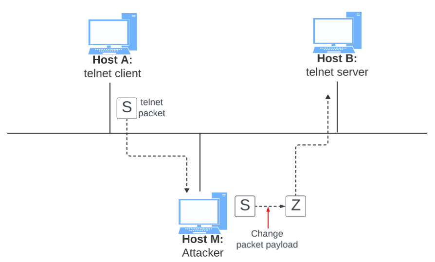

In particular, you will use the ARP attack to launch a machine-in-the-middle attack, where the attacker can intercept and modify the packets between the two victims A and B. 


## Task 2: MITM attack on `telnet` using ARP cache poisoning

Hosts __A__ and __B__ are communicating using `telnet`, and Host __M__ wants to intercept their communication, so it can make changes to the data sent between __A__ and __B__. The setup is depicted in Figure 2. 



__Figure 2.__ Machine in the middle attack against `telnet`.

__Step 1 (Launch the ARP cache poisoning attack):__ First, Host __M__ conducts an ARP cache poisoning attack on both __A__ and __B__, such that in __A__’s ARP cache, __B__’s IP address maps to __M__’s MAC address, and in __B__’s ARP cache, __A__’s IP address also maps to __M__’s MAC address. After this step, packets sent between __A__ and __B__ will all be sent to __M__. We will use the ARP cache poisoning attack from Task 1 to achieve this goal. It is better that you send out the spoofed packets constantly (e.g. every 5 seconds); otherwise, the fake entries may be replaced by the real ones.

__Step 2 (Testing):__ After the attack is successful, please try to ping each other between Hosts __A__ and __B__, and report your observation. Please show `tcpdump` results in your README.md file. Before doing this step, please make sure that the IP forwarding on Host __M__ is turned off. You can do that with the following command (as root):

```shell
$ sudo sysctl net.ipv4.ip_forward=0
```

__Step 3 (Turn on IP forwarding):__ Now we turn on the IP forwarding on Host __M__, so it will forward the packets between __A__ and __B__. Please run the following command (as root) and repeat Step 2. Please describe your observation in your README.md file.

```shell
$ sudo sysctl net.ipv4.ip_forward=1
```

__Step 4 (Launch the MITM attack):__ We are ready to make changes to the `telnet` data between __A__ and __B__. Assume that __A__ is the `telnet` client and __B__ is the `telnet` server. After __A__ has connected to the telnet server on __B__, for every key stroke typed in A’s `telnet` window, a TCP packet is generated and sent to __B__. We would like to intercept the TCP packet, and replace each typed character with a fixed character (say Z). This way, it does not matter what the user types on A, `telnet` will always display Z. From the previous steps, we are able to redirect the TCP packets to Host M, but instead of forwarding them, we would like to replace them with a spoofed packet. We will write a sniff-and-spoof program to accomplish this goal. In particular, we would like to do the following:

- We first keep the IP forwarding on, so we can successfully create a `telnet` connection between __A__ to __B__. Once the connection is established, we turn off the IP forwarding using the following command (run as root). Please type something on __A__’s `telnet` window, and report your observation:

```shell 
$ sudo sysctl net.ipv4.ip_forward=0
```

- We run our sniff-and-spoof program on Host __M__, such that for the captured packets sent from __A__ to __B__, we spoof a packet but with TCP different data. For packets from __B__ to __A__ (telnet response), we do not make any change, so the spoofed packet is exactly the same as the original one.

To help you get started, we provide a skeleton sniff-and-spoof program below. The program captures all the TCP packets, and then for packets from __A__ to __B__, it makes some changes (the modification part is not included, because that is part of the task). For packets from __B__ to __A__, the program does not make any change.

```python
#!/usr/bin/env python
from scapy.all import *

IP_A = "172.18.123.6"
MAC_A = "e8:6a:64:ce:4b:df"
IP_B = "172.18.123.5"
MAC_B = "e8:6a:64:ce:4c:cd"

def spoof_pkt(pkt):
    if pkt[IP].src == IP_A and pkt[IP].dst == IP_B:
        # Create a new packet based on the captured one.
        # 1) We need to delete the checksum in the IP & TCP headers,
        # because our modification will make them invalid.
        # Scapy will recalculate them if these fields are missing.
        # 2) We also delete the original TCP payload.
        
        newpkt = IP(bytes(pkt[IP]))
        del(newpkt.chksum)
        del(newpkt[TCP].payload)
        del(newpkt[TCP].chksum)

        #################################################################
        # Construct the new payload based on the old payload.
        # You need to implement this part.

        if pkt[TCP].payload:
            data = pkt[TCP].payload.load # The original payload data
            newdata = data # No change is made in this sample code
            send(newpkt/newdata)
        else:
            send(newpkt)

        ################################################################

    elif pkt[IP].src == IP_B and pkt[IP].dst == IP_A:
        # Create new packet based on the captured one
        # Do not make any change

        newpkt = IP(bytes(pkt[IP]))
        del(newpkt.chksum)
        del(newpkt[TCP].chksum)
        send(newpkt)

f = 'tcp'
pkt = sniff(iface='eth0', filter=f, prn=spoof_pkt)
```

It should be noted that the code above captures all the TCP packets, including the one generated by the program itself. That is undesirable, as it will affect the performance. You need to change the filter, so it does not capture its own packets.

Behavior of `telnet`. In `telnet`, typically, every character we type in the `telnet` window triggers an individual TCP packet, but if you type very fast, some characters may be sent together in the same packet. That is why in a typical `telnet` packet from client to server, the payload only contains one character. The character sent to the server will be echoed back by the server, and the client will then display the character in its window. Therefore, what we see in the client window is not the direct result of the typing; whatever we type in the client window takes a round trip before it is displayed. If the network is disconnected, whatever we typed on the client window will not displayed, until the network is recovered. Similarly, if attackers change the character to Z during the round trip, Z will be displayed at the `telnet` client window, even though that is not what you have typed.

Report the results of your attack in your `README.md` file.


## Task 3: MITM Attack on Netcat using ARP Cache Poisoning

This task is similar to Task 2, except that Hosts A and B are communicating using `netcat`, instead of `telnet`. Host __M__ wants to intercept their communication, so it can make changes to the data sent between __A__ and __B__. You can use the following commands to establish a `netcat` TCP connection between __A__ and __B__:

On Host __B__ (server, IP address is 172.18.123.5), run the following:

* __Pick a random port between 1000 and 5000.__ Replace port `1234` below with your random port number choice.

```shell
$ nc -lp 1234
```

On Host __A__ (client), run the following:

```shell
$ nc 172.18.123.5 1234
```

Once the connection is made, you can type messages on __A__. Each line of messages will be put into a TCP packet sent to __B__, which simply displays the message. Your task is to replace every occurrence of your first name in the message with a sequence of __A__’s. The length of the sequence should be the same as that of your first name, or you will mess up the TCP sequence number, and hence the entire TCP connection. You need to use your real first name, so we know the work is done by you.

Report the results of your attack in your `README.md` file.