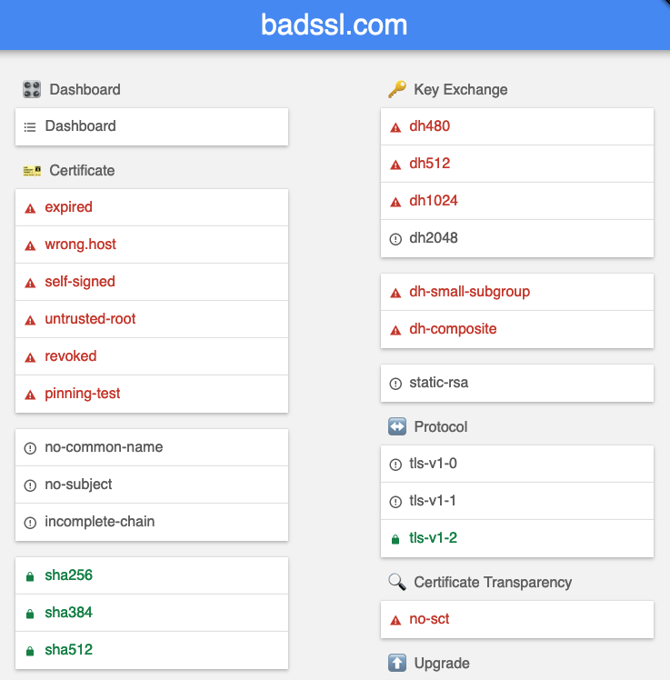
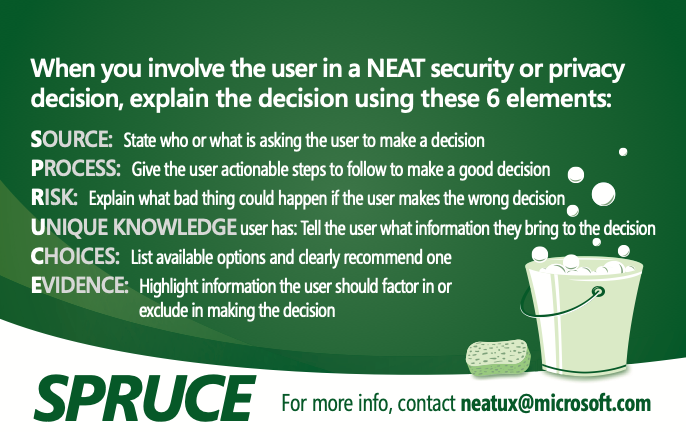

# Module 17: Usable Security: Warning Messages 

* Put your answers in the `README.md` file in the GitHub repository.
* Github Classroom Link: [https://classroom.github.com/a/7Z-Q0nAv](https://classroom.github.com/a/7Z-Q0nAv)

## Resources

* [baddssl.com](https://badssl.com/)

## Exercise - Review the current state of browser warning messages 

1. Using __two__ different browsers such as Chrome and Firefox, or Safari and Edge, navigate to the [baddssl.com](https://badssl.com/) web page. 

2. Using both browsers click on various bad links such as expired certificate, self-signed certificate, http (under HTTP), and webpack-dev-server (under Known Bad).

3. For up to __four__ different bad links on __two__ different web browsers, describe the warning message that you received from the browser. 

4. Give your reaction and opinion regarding the effectiveness of the warning message. Would you "click through" or would you not go to a web site that had this warning message?

5. For each warning message on both browsers, report which of the `NEAT` and `SPRUCE` design parameters where followed and are present in the warning message, and which ones where not followed and are not present in the warning message. 

